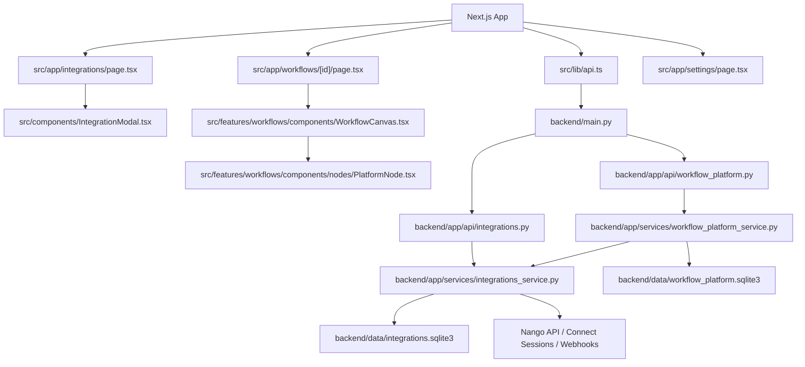

# AuraFlow Review Graph

This file is the low-token map for code review, onboarding, and future agent work.

## Fast Path

If you only read a few files, read these first:

1. `backend/main.py`
2. `backend/app/api/integrations.py`
3. `backend/app/services/integrations_service.py`
4. `backend/app/services/workflow_platform_service.py`
5. `src/lib/api.ts`
6. `src/components/IntegrationModal.tsx`
7. `src/app/workflows/[id]/page.tsx`
8. `src/features/workflows/components/WorkflowCanvas.tsx`

## System Graph

## Review Order

### 1. Integration Surface

- `backend/app/api/integrations.py`
- `src/lib/api.ts`
- `src/components/IntegrationModal.tsx`

Review for:
- request/response shape drift
- missing route compatibility
- polling/disconnect UX
- session-token-only OAuth flow

### 2. Integration State + Persistence

- `backend/app/services/integrations_service.py`

Review for:
- sqlite schema evolution
- provider mapping correctness
- connection status transitions
- webhook verification and disconnect behavior
- rate limiting and demo-user ownership enforcement

### 3. Workflow Coupling

- `backend/app/services/workflow_platform_service.py`

Review for:
- `provider_slug` coverage on integration nodes
- `Connect first` validation behavior
- execution-time connection lookup

### 4. Workflow Builder UI

- `src/app/workflows/[id]/page.tsx`
- `src/features/workflows/components/WorkflowCanvas.tsx`
- `src/features/workflows/components/nodes/PlatformNode.tsx`

Review for:
- validation banner propagation
- lock/debug behavior
- integration-related node warnings

## Key Contracts

### Integrations API

- `GET /api/integrations`
- `POST /api/integrations/create-session`
- `GET /api/integrations/status`
- `POST /api/integrations/save-api-key`
- `POST /api/integrations/webhook`
- `DELETE /api/integrations/{provider}`

### Frontend Types

- `IntegrationProvider`
- `IntegrationConnection`
- `OAuthSessionResponse`
- `IntegrationStatusResponse`

### Workflow Coupling

- integration nodes depend on `provider_slug`
- validation fails if no connected provider exists
- execution resolves stored `connection_id` / `connection_ref`

## Hot Spots

### If OAuth is broken

Check:
- `src/components/IntegrationModal.tsx`
- `backend/app/api/integrations.py`
- `backend/app/services/integrations_service.py`
- `NANGO_SECRET_KEY`

### If provider shows disconnected after auth

Check:
- `GET /api/integrations/status`
- webhook delivery to `/api/integrations/webhook`
- `NANGO_PROVIDER_MAP`
- sqlite row in `backend/data/integrations.sqlite3`

### If workflow nodes cannot run

Check:
- `provider_slug` on node metadata
- `has_connection()` and `get_connection()`
- workflow validation output in `workflow_platform_service.py`

## Ignore During Review

Usually skip unless debugging environment problems:

- `.next/`
- `node_modules/`
- `backend/__pycache__/`
- `backend/app/**/__pycache__/`
- `backend/data/*.sqlite3`
- `backend-server.out.log`
- `backend-server.err.log`

## One-Line Mental Model

AuraFlow is a Next.js workflow builder on top of a FastAPI execution engine, with integrations and workflow validation meeting in the backend service layer.
